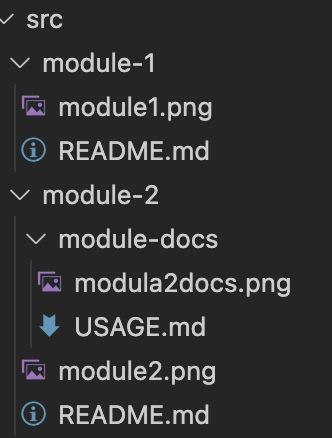

# Typedoc plugin example

This repo tries to be minimal representation of couple of Typedoc lugin feature requests.

Directory structure:

]

Modules:
- [Module 1](./src/module-1/README.md)
- [Module 2](./src/module-2/README.md)
