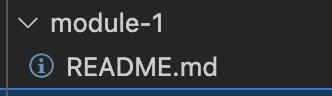
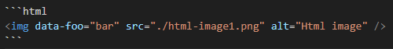
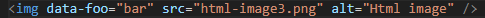
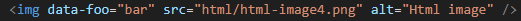

# Module 1

This is kind of module exported as namespace from main module

Also image (won't be included because of extension filter):



## Html img tag

Paths will be replaced even in code blocks.

```html




```

This is not really recommended, but works:


You can exclude items with regex:

```html

```
