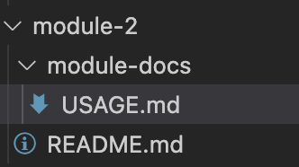

# Usage things for module 2

This file is something that could be referred in main README and also should be available in generated documentation.

Separated so it's easy to import e.g. to Confluence.

Image also:

